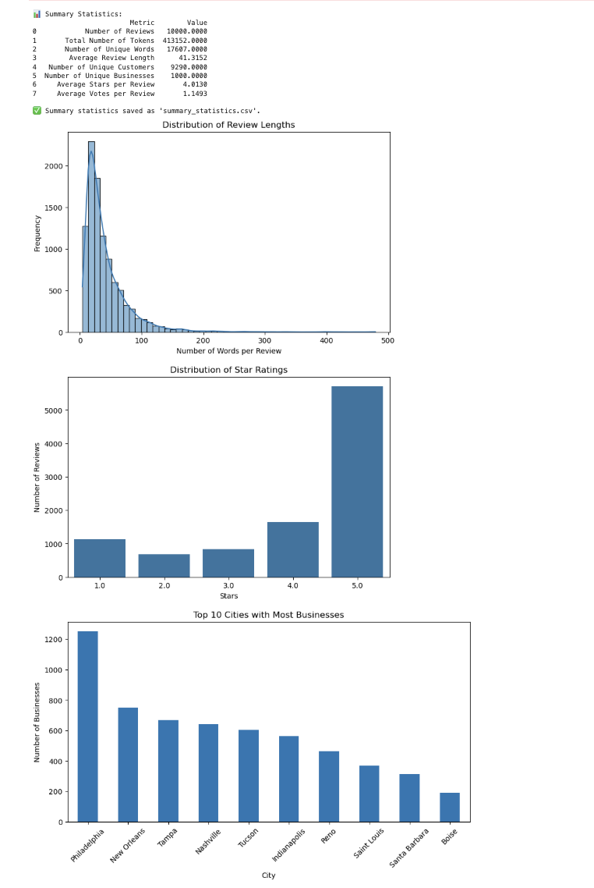

# Yelp Market Analysis – Prime Restaurant Locations & Cuisines

This project analyzes Yelp review and business data to identify high-potential U.S. regions for restaurant expansion and uncovers underserved cuisines using sentiment analysis, review trends, and location-based clustering.

---

## Objective

- Use Yelp business and review data to recommend optimal restaurant locations
- Identify underserved cuisines with high demand and low competition
- Apply sentiment analysis to gauge customer satisfaction trends

---

## Tools Used

- Python (Pandas, NumPy, Matplotlib, Seaborn)
- NLP: NLTK, SpaCy, VADER
- Machine Learning: Logistic Regression, Naive Bayes, Random Forest, LSTM
- Geospatial Clustering: KMeans
- Jupyter Notebook

---

## Project Summary

- Filtered Yelp data to include 10,000 reviews from 1,000 active restaurants across two major U.S. cities
- Conducted exploratory analysis to understand review length, rating trends, and business distribution
- Applied SpaCy and VADER for sentiment scoring and text preprocessing
- Found that **85% of reviews were Positive**, with strong mentions of food quality and service
- Built multiple sentiment classifiers (TF-IDF + Logistic Regression, Naive Bayes, and LSTM)
- Used KMeans clustering to identify regional saturation and highlight expansion zones

---

## Insights

- **Underserved cuisines** with potential: Cajun/Creole, Acai Bowls, Chicken Wings
- **Top regions for growth**: Martin County (IN), Hillsborough (FL), New Orleans (LA)
- **Oversaturated categories**: American (New), Traditional American, Bars
- VADER sentiment showed that 85%+ reviews were positive, validating customer satisfaction in targeted categories

---

## Sample Visuals

This figure summarizes the exploratory analysis on Yelp reviews:

- Distribution of review lengths
- Star rating breakdown
- Cities with the most businesses

---

## Dataset

- [Yelp Academic Dataset](https://www.yelp.com/dataset)

---

